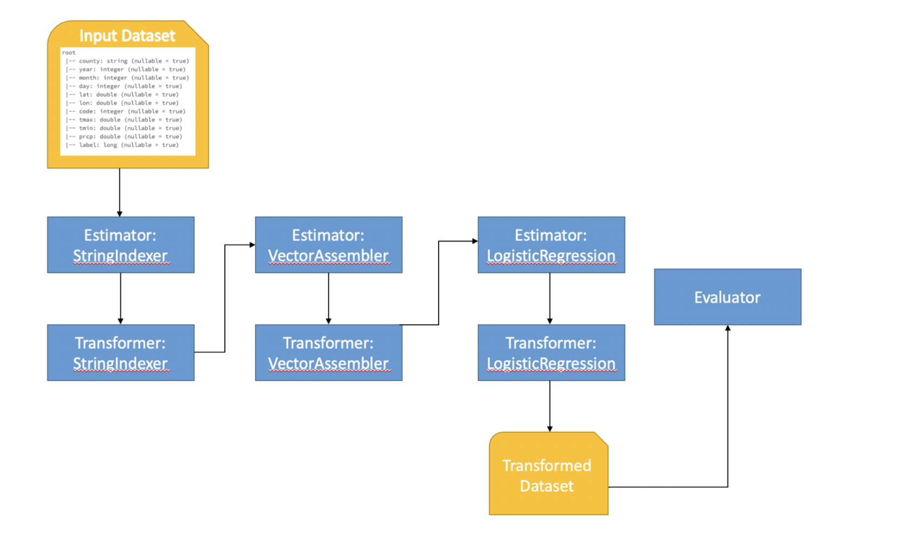

# Black Bears in California
Of late we hear stories about how they have been sighted closer to urban areas. We were curious to see if information like weather conditions and the time of the year are some factors that influence the activity of the bears encroaching on the urban areas. If our hypothesis is correct, then this information could be used as an early warning tool to alert residents in urban areas of immediate bears sightings near them. Given input features such as daily temperature and precipitation, and time of the year, we aim to predict if bears will in the future re-appear in areas where they have been sighted historically.

#### Data Used:
1. iNaturalist - Californian black bear sighting dataset
2. NOAA weather - Daily weather dataset
3. NLCD land use - NLCD national land use specification dataset
4. Openstreetmap for county data (through the GeoPy package which interfaces with Nominatim)

#### Overview of Data Engineering Pipeline
The cloud services that we used in the data pipeline to store the data are Google Cloud storage and MongoDB Atlas. Apache Airflow was deployed to facilitate the automation of the required data pipeline tasks. We also developed and maintained DAG scripts that Airflow requires for it to function as desired. Below is a diagram that will help illustrate our data pipeline.

The data at the end of the data pipeline will form our training data for the machine learning algorithm that we will implement.

#### Overview of ML Goals
For our algorithm, we decided to use Logistic Regression since we want to predict the probability of a bear appearing in a certain region given the temperature, precipitation, land type, and time of year. We tuned 3 hyperparameters - maximum number of iterations, elastic net mixing parameters, and the regularization parameter using grid search in spark ML (ParamGridBuilder). To enable this, we used Databricks and Spark distributed environment to train our model. We designed a strategy to cross-validate our logistic classifier model with 5 folds ensuring a robust model. We used the accuracy (or Area under AUC) metric to measure the cross-validated accuracy of the model. During the cross-validation estimation, we also embedded some hyperparameters to tune them. 